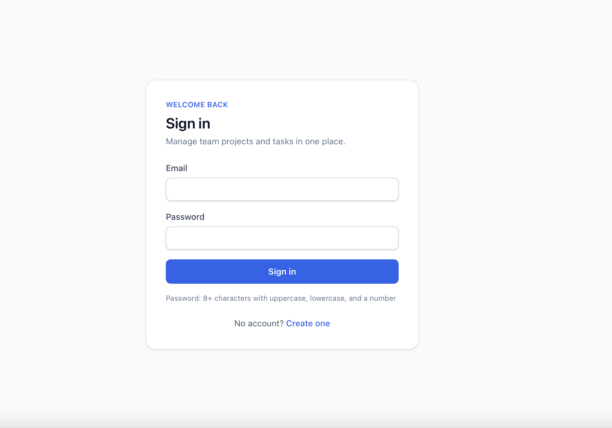
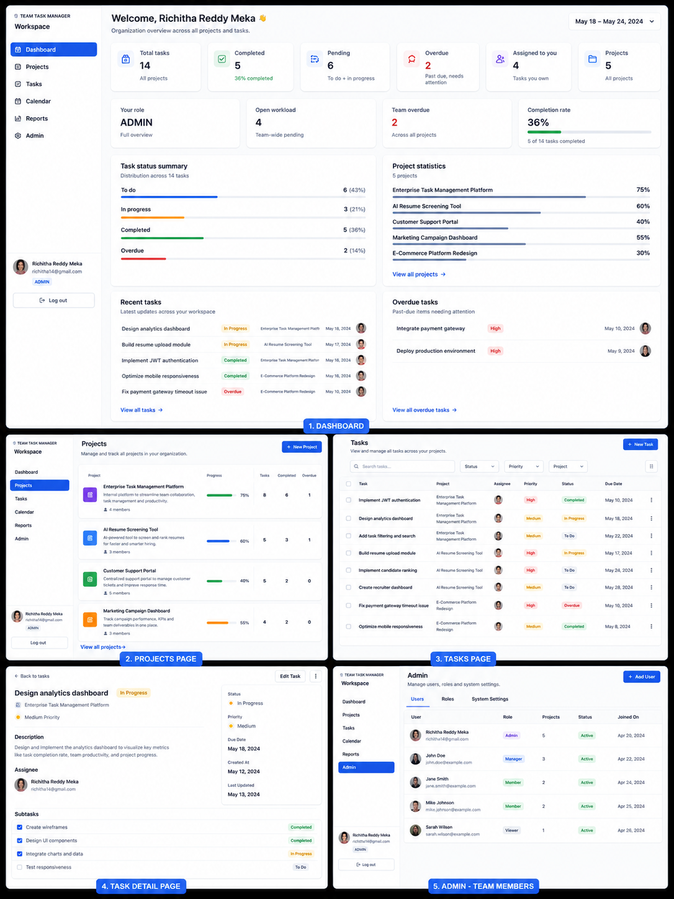
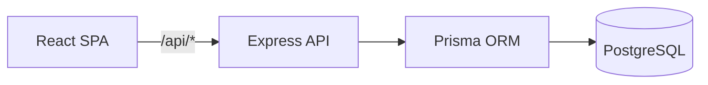
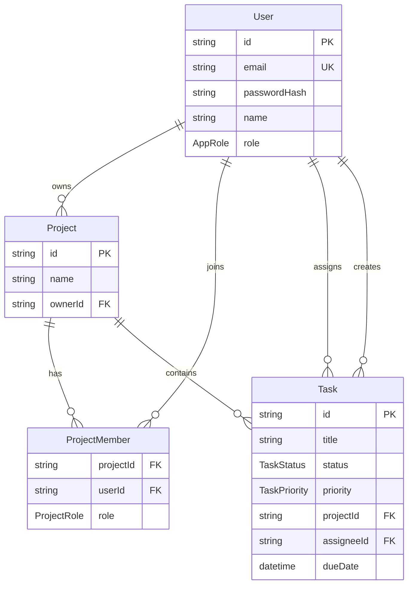

# Team Task Manager

A full-stack team task management application for organizing projects, assigning work, and tracking progress with role-based access control.

**Live demo:**  [Team Task Manager](https://team-task-manager-production-a1c4.up.railway.app)
**📂 Repository:** [GitHub Repo](https://github.com/richitha14/team-task-manager)  
**Demo video:** [Add Loom/YouTube link](#)

---

## Screenshots


### Login Page

Secure authentication with JWT-based login and role-based access control.



### Platform Overview

Complete overview of the Team Task Manager including dashboard analytics, project management, task tracking, priorities, and admin workflow.



---

## Overview

Team Task Manager helps small teams coordinate work across projects. Users sign up, join projects, manage tasks with priorities and due dates, and view a real-time dashboard of team activity. The first registered user becomes an application **Admin**; subsequent users are **Members**.

Built as a production-ready monorepo with JWT authentication, PostgreSQL persistence, Prisma ORM, and deployment on Railway.

---

## Features

### Authentication & security
- Email/password signup and login with bcrypt hashing
- JWT sessions with persistent login (localStorage + `/api/auth/me`)
- Rate limiting on auth routes
- Zod validation on all inputs
- Production-safe environment validation

### Role-based access control
- **App roles:** `ADMIN` (full workspace) and `MEMBER` (scoped access)
- **Project roles:** `ADMIN` (manage project) and `MEMBER` (view / limited task updates)
- Protected API routes and UI routes

### Projects & teams
- Full project CRUD
- Add/remove members from registered users (search by name/email — no email invites)
- Assign project-level roles
- Member list with role management

### Tasks
- Task CRUD with title, description, status, priority, due date, assignee
- Statuses: `TODO`, `IN_PROGRESS`, `COMPLETED`
- Priorities: `LOW`, `MEDIUM`, `HIGH`
- Filter by status, priority, assignee; search by title/description
- Overdue detection (past due + not completed)
- Project admins: full control; members: update status on assigned tasks only

### Dashboard
- Total, completed, pending, and overdue task counts
- Tasks assigned to current user
- Project statistics
- Task status summary (CSS bar chart — no heavy chart libraries)
- Recent and overdue task lists
- Role-scoped data (admin vs member views)

---

## Tech stack

| Layer | Technologies |
|-------|----------------|
| **Frontend** | React 19, TypeScript, Vite, Tailwind CSS v4, React Router |
| **Backend** | Node.js, Express 5, TypeScript |
| **Database** | PostgreSQL, Prisma ORM |
| **Auth** | JWT, bcryptjs |
| **Validation** | Zod |
| **Deployment** | Railway (single-service: API + static frontend) |
| **Dev** | Docker Compose (local Postgres), npm workspaces |

---

## Architecture

```
team-task-manager/
├── client/                 # React SPA (Vite)
├── server/                 # Express REST API
│   ├── prisma/             # Schema & migrations
│   └── src/
│       ├── routes/         # API route modules
│       ├── services/       # Business logic
│       ├── middleware/     # Auth, RBAC, validation
│       └── controllers/
├── packages/shared/        # Shared types & API constants
├── docker-compose.yml      # Local PostgreSQL
├── railway.toml            # Railway deploy config
└── scripts/                # Tests & demo script
```

### Request flow



**Production (Railway):** One service builds the client, runs API migrations on startup, and serves the React build from Express (`SERVE_CLIENT=true`) — same origin, no CORS issues.

---

## Database schema



| Model | Purpose |
|-------|---------|
| **User** | Accounts with app-level `ADMIN` or `MEMBER` role |
| **Project** | Team workspace owned by a user |
| **ProjectMember** | Many-to-many users ↔ projects with `ADMIN`/`MEMBER` |
| **Task** | Work items linked to a project and optional assignee |

---

## API routes

Base URL: `/api`  
Auth: `Authorization: Bearer <token>` (except signup/login/health)

### Health
| Method | Route | Description |
|--------|-------|-------------|
| GET | `/health` | Service + database health check |

### Auth
| Method | Route | Description |
|--------|-------|-------------|
| POST | `/auth/signup` | Register (first user → ADMIN) |
| POST | `/auth/login` | Login, returns JWT |
| GET | `/auth/me` | Current user (protected) |
| POST | `/auth/logout` | Logout (protected) |

### Dashboard
| Method | Route | Description |
|--------|-------|-------------|
| GET | `/dashboard` | Aggregated stats (protected) |

### Admin (app ADMIN only)
| Method | Route | Description |
|--------|-------|-------------|
| GET | `/admin/users` | List all users |
| PATCH | `/admin/users/:userId/role` | Update user app role |

### Users
| Method | Route | Description |
|--------|-------|-------------|
| GET | `/users/search?q=` | Search registered users (for adding to projects) |

### Projects
| Method | Route | Description |
|--------|-------|-------------|
| GET | `/projects` | List accessible projects |
| POST | `/projects` | Create project |
| GET | `/projects/:id` | Project detail + members |
| PATCH | `/projects/:id` | Update project (project ADMIN) |
| DELETE | `/projects/:id` | Delete project (project ADMIN) |
| GET | `/projects/:id/members` | List members |
| POST | `/projects/:id/members` | Add member by `userId` (project ADMIN) |
| PATCH | `/projects/:id/members/:userId` | Update member role |
| DELETE | `/projects/:id/members/:userId` | Remove member |

### Tasks (under project)
| Method | Route | Description |
|--------|-------|-------------|
| GET | `/projects/:id/tasks` | List/filter/search tasks |
| POST | `/projects/:id/tasks` | Create task (project ADMIN) |
| GET | `/projects/:id/tasks/:taskId` | Get task |
| PATCH | `/projects/:id/tasks/:taskId` | Update task (admin: full; member: status on assigned only) |
| DELETE | `/projects/:id/tasks/:taskId` | Delete task (project ADMIN) |

Query params for tasks: `status`, `priority`, `assigneeId`, `q`

---

## Role-based access

### Application level

| Capability | ADMIN | MEMBER |
|------------|-------|--------|
| View all projects | Yes | Assigned only |
| Admin user management | Yes | No |
| Dashboard scope | Workspace-wide | Personal / assigned |

### Project level

| Capability | Project ADMIN | Project MEMBER |
|------------|---------------|----------------|
| Edit/delete project | Yes | No |
| Manage members | Yes | No |
| Create/edit/delete tasks | Yes | No |
| View tasks | Yes | Yes |
| Update task status | Any task | Assigned tasks only |

---

## Environment variables

See [`.env.example`](./.env.example) for local development.  
See [`.env.railway.example`](./.env.railway.example) for production.

| Variable | Required | Description |
|----------|----------|-------------|
| `DATABASE_URL` | Yes | PostgreSQL connection string |
| `JWT_SECRET` | Yes | Min 32 characters; strong random in production |
| `JWT_EXPIRES_IN` | No | Default `7d` |
| `NODE_ENV` | No | `development` or `production` |
| `PORT` | No | Default `3001` (Railway sets automatically) |
| `CORS_ORIGIN` | No | Comma-separated origins; use public URL in production |
| `SERVE_CLIENT` | No | `true` to serve React build from Express |
| `VITE_API_URL` | No | Dev: `http://localhost:3001`; production same-origin: leave empty |

---

## Local development

### Prerequisites
- Node.js 20+
- Docker (for local PostgreSQL) or existing Postgres instance

### Setup

```bash
# Clone the repository
git clone https://github.com/your-username/team-task-manager.git
cd team-task-manager

# Install dependencies
npm install

# Environment
cp .env.example .env
# Edit .env — set JWT_SECRET (32+ chars)

# Start PostgreSQL
docker compose up -d

# Run migrations
npm run db:migrate

# Start client + API
npm run dev
```

- **Frontend:** http://localhost:5173  
- **API:** http://localhost:3001  
- **Health:** http://localhost:3001/api/health  

### Useful commands

```bash
npm run dev              # Client + server (concurrent)
npm run dev:client       # Vite only
npm run dev:server       # API only
npm run build            # Production build (all workspaces)
npm run db:studio        # Prisma Studio
npm run test:auth -w server
npm run test:projects -w server
npm run test:tasks -w server
npm run test:dashboard -w server
```

---

## Railway deployment

### Recommended: single service

1. Push repo to GitHub.
2. [Railway](https://railway.com) → **New Project** → **Deploy from GitHub repo**.
3. Add **PostgreSQL** plugin (injects `DATABASE_URL`).
4. Set variables:

| Variable | Value |
|----------|--------|
| `NODE_ENV` | `production` |
| `JWT_SECRET` | `openssl rand -base64 48` |
| `CORS_ORIGIN` | `https://${{RAILWAY_PUBLIC_DOMAIN}}` |
| `SERVE_CLIENT` | `true` |

5. Deploy uses [`railway.toml`](./railway.toml):
   - **Build:** `npm ci && npm run build`
   - **Start:** `npm run start:production` (runs migrations + server)
   - **Health check:** `/api/health`
6. Generate a public domain and open your app.

### Verify deployment

```bash
curl https://YOUR_DOMAIN/api/health
# Expect: {"status":"ok","database":"connected",...}
```

---

## Demo script

A 2–5 minute walkthrough for recruiters is in [`scripts/DEMO_SCRIPT.md`](./scripts/DEMO_SCRIPT.md).

---

## Submission checklist

See [`SUBMISSION_CHECKLIST.md`](./SUBMISSION_CHECKLIST.md) for pre-submission verification.

---

## License

MIT
